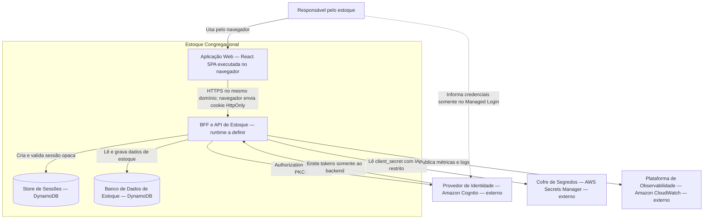
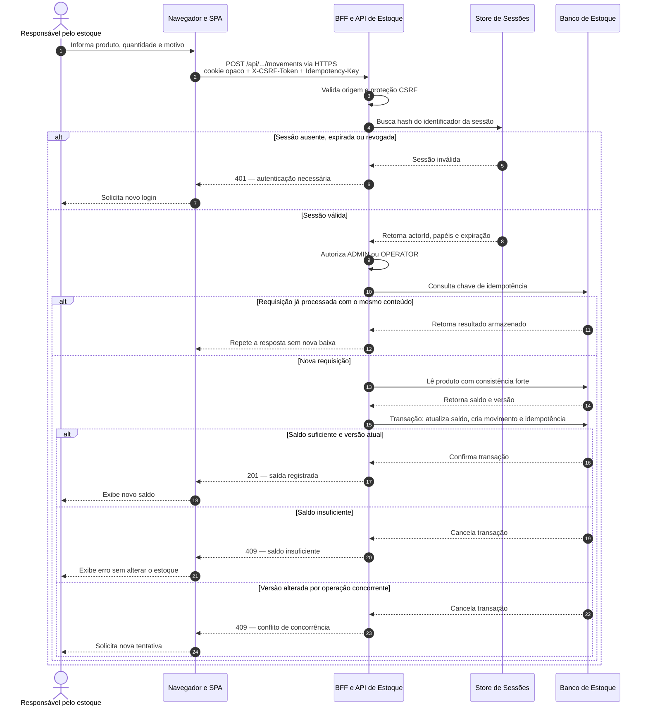

# Estoque Congregacional

> Base de documentação arquitetural de um sistema web para controle de estoque de uma igreja, produzida com a abordagem *diagrams as code*.

## Objetivo

Este repositório concentra o discovery e a especificação arquitetural do **Estoque Congregacional**. Os artefatos foram organizados para serem versionáveis, revisáveis e utilizáveis como contexto por futuros agentes de desenvolvimento.

O repositório documenta a arquitetura; ele **não contém uma aplicação implementada**. As tecnologias da baseline são propostas registradas em ADRs e precisam de aceite humano antes do início do desenvolvimento.

## Visão do sistema

O Estoque Congregacional apoiará uma única igreja no controle de produtos de limpeza, materiais de escritório, itens descartáveis e materiais usados em eventos. Usuários autorizados poderão cadastrar produtos, registrar entradas e saídas, consultar saldos, visualizar o histórico e identificar itens abaixo do estoque mínimo.

### Escopo

- Cadastro e consulta de produtos.
- Registro de entradas e saídas.
- Consulta do saldo atual.
- Histórico de movimentações por produto.
- Indicação visual de estoque mínimo.
- Autenticação e autorização de usuários.
- Auditoria mínima das operações.

### Fora do escopo

- Compras, pagamentos e emissão de notas fiscais.
- Integração com fornecedores ou ERP.
- Controle de validade, lote ou localização física.
- Funcionamento offline.
- Múltiplas igrejas na mesma instalação.
- Alertas por e-mail, SMS ou aplicativos de mensagens.

### Regras invariantes

1. O saldo de um produto nunca pode ficar negativo.
2. Toda entrada ou saída deve gerar uma movimentação imutável e rastreável.
3. Alteração de saldo, criação da movimentação e registro de idempotência devem ser atômicos.
4. Uma repetição com a mesma chave de idempotência e o mesmo conteúdo não pode duplicar o efeito.
5. Uma mesma chave de idempotência com conteúdo diferente deve ser rejeitada.
6. O frontend não pode receber JWT, `client_secret` ou credenciais AWS.
7. Operações autenticadas por cookie que alteram estado devem validar proteção CSRF.

## Baseline arquitetural proposta

| Responsabilidade | Solução proposta | Situação |
| --- | --- | --- |
| Interface web | SPA React em Amazon S3 e CloudFront | Proposta no ADR-001 |
| Identidade | Cognito com Authorization Code e PKCE, acessado por BFF confidencial | Proposta no ADR-003 |
| Sessão do navegador | Cookie opaco `Secure`, `HttpOnly` e `SameSite=Strict`; tokens no servidor | Proposta no ADR-003 |
| Gestão de segredos | `client_secret` no AWS Secrets Manager, acessível somente pelo BFF | Proposta no ADR-003 |
| Entrada HTTP | CloudFront no mesmo domínio e API Gateway apenas como roteador | Proposta no ADR-001 |
| BFF e regras de negócio | Monólito modular em AWS Lambda; runtime ainda não escolhido | ADR-001 e ADR-005 |
| Persistência | Amazon DynamoDB com single-table design | Proposta no ADR-002 |
| Sessões | Store DynamoDB isolado, com expiração, revogação e TTL | Proposta no ADR-003 |
| Consistência de movimentações | Transação, condição de saldo e chave de idempotência | Proposta no ADR-004 |
| Observabilidade | Logs, métricas e alarmes no Amazon CloudWatch | Proposta no ADR-001 |

### TypeScript, Node.js ou Python?

TypeScript e Node.js não são escolhas equivalentes: **TypeScript é uma linguagem** que normalmente é compilada para JavaScript; **Node.js é o runtime** que executa esse JavaScript. A comparação adequada é “Node.js com TypeScript” versus “Python”. Como o discovery não informou experiência da equipe nem restrições de runtime, a arquitetura não escolhe nenhuma das duas. A decisão e seus critérios estão no [ADR-005](docs/decisions/ADR-005-backend-runtime.md).

## Diagrama estrutural — visão de containers

O desenho mantém o nível de containers inspirado no C4. Serviços gerenciados externos ao limite lógico da aplicação são identificados como externos.



Fonte versionada: [`docs/diagrams/containers.mmd`](docs/diagrams/containers.mmd).

> **Erros identificados na revisão:** a primeira versão dizia que o usuário “usa via HTTPS”, deixava ambíguo quem gerava o JWT e escolhia TypeScript sem evidência. Uma revisão intermediária ainda mantinha o access token no navegador. O fluxo final representa a pessoa usando a aplicação, o BFF recebendo tokens do Cognito, o Secrets Manager acessível somente pelo backend e o runtime como decisão pendente. O histórico completo está no [registro de inferências](docs/discovery/inferences.md).

O fluxo de login detalhado está no [diagrama de sequência de autenticação](docs/diagrams/authentication-sequence.mmd). Ele deixa explícito que o usuário digita a senha somente no Cognito, o BFF lê o `client_secret`, valida OAuth e devolve ao navegador apenas uma sessão opaca.

## Diagrama comportamental — registro de saída

A jornada crítica considera o usuário autenticado e apresenta repetição idempotente, sucesso, saldo insuficiente e conflito concorrente.



Fonte versionada: [`docs/diagrams/stock-exit-sequence.mmd`](docs/diagrams/stock-exit-sequence.mmd).

## Evidência do uso de GenAI

A distinção entre fatos, inferências, decisões propostas, ajustes e lacunas está registrada em [`docs/discovery/inferences.md`](docs/discovery/inferences.md). Esse registro evita apresentar escolhas produzidas pelo modelo como se fossem requisitos fornecidos.

Em resumo:

- O modelo inferiu corretamente a separação entre interface, regras e persistência, a necessidade de autenticação e o risco de saldo insuficiente.
- O modelo errou ao associar `HTTPS` à ação humana, deixou ambíguo quem emitia o JWT e tratou TypeScript como decisão de plataforma; os pontos foram corrigidos e registrados.
- O fluxo SPA + PKCE sugerido na revisão intermediária era tecnicamente válido para cliente público, mas não atendia à restrição posterior de manter JWT fora do navegador; por isso foi substituído por BFF.
- O `client_id` foi corretamente classificado como identificador público; o `client_secret` passou a existir somente no Secrets Manager e no backend.
- A revisão limitou a solução a uma única API modular, retirou notificações externas e tornou explícita a atomicidade da movimentação.
- AWS, React, Cognito, Lambda, DynamoDB, BFF e idempotência foram convertidos em decisões propostas e documentados em ADRs, em vez de serem tratados como fatos.
- Ainda faltam escolha do runtime, política de sessão e rotação, validação de volume, disponibilidade, orçamento, retenção e aceite formal dos ADRs.

## Organização do repositório

```text
.
├── .github/workflows/              # Validação automatizada dos artefatos
├── docs/
│   ├── decisions/                  # Architecture Decision Records (ADRs)
│   ├── diagrams/                   # Fontes Mermaid
│   ├── discovery/                  # Requisitos, lacunas e inferências
│   ├── dynamodb/                   # Modelo, acessos e transações
│   ├── mapping/                    # Rastreabilidade entre artefatos
│   ├── schemas/                    # Contratos JSON Schema
│   ├── security/                   # Segurança e observabilidade
│   ├── tests/                      # Cenários de aceitação arquitetural
│   ├── agent-context.md            # Regras para futuros agentes
│   ├── architecture.md             # Visão arquitetural consolidada
│   └── openapi.yaml                # Contrato HTTP OpenAPI 3.1
├── scripts/validate_architecture.py
└── README.md
```

## Índice dos artefatos

- [Descrição e arquitetura consolidada](docs/architecture.md)
- [Requisitos e regras de negócio](docs/discovery/requirements.md)
- [Inferências e ajustes da GenAI](docs/discovery/inferences.md)
- [Registro dos prompts](docs/discovery/prompt-log.md)
- [Lacunas e perguntas em aberto](docs/discovery/open-questions.md)
- [Contexto para agentes](docs/agent-context.md)
- [Diagrama de implantação AWS](docs/diagrams/deployment.mmd)
- [Sequência de autenticação BFF](docs/diagrams/authentication-sequence.mmd)
- [Contrato OpenAPI](docs/openapi.yaml)
- [Modelo DynamoDB](docs/dynamodb/data-model.md)
- [Padrões de acesso](docs/dynamodb/access-patterns.md)
- [Transação e idempotência](docs/dynamodb/transaction-spec.md)
- [Segurança e observabilidade](docs/security/security-and-observability.md)
- [Modelo de sessão do BFF](docs/security/session-management.md)
- [Cenários de aceitação](docs/tests/acceptance-scenarios.md)
- [Matriz de rastreabilidade](docs/mapping/traceability.md)
- [ADRs propostos](docs/decisions/)

## Validação local

Com Python 3 e PyYAML instalados:

```bash
python -m pip install pyyaml
python scripts/validate_architecture.py
```

O mesmo validador é executado pelo GitHub Actions para conferir JSON, YAML, referências locais, links Markdown e sincronismo entre os diagramas exibidos neste README e seus arquivos `.mmd`.

## Status

**Arquitetura proposta — aguardando revisão e aceite humano antes da implementação.**
