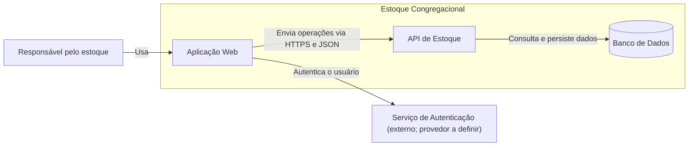
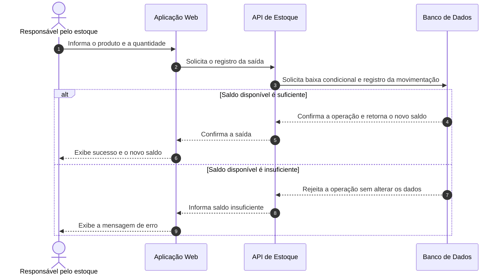

# Estoque Congregacional

> Documentação arquitetural de um sistema web para controle de estoque de uma igreja, com diagramas C4 e de sequência em Mermaid.

## Objetivo do repositório

Este repositório concentra a fase inicial de discovery do **Estoque Congregacional**. A documentação foi escrita em linguagem natural e os diagramas foram mantidos como código para que possam ser versionados, revisados e reproduzidos.

O conteúdo também poderá servir futuramente como contexto para agentes de desenvolvimento, desde que as lacunas registradas neste documento sejam resolvidas antes da implementação.

## Descrição do sistema

O Estoque Congregacional será uma aplicação web para apoiar o controle de materiais utilizados por uma única igreja, como produtos de limpeza, materiais de escritório, itens descartáveis e materiais empregados em eventos.

Usuários autorizados poderão cadastrar produtos, registrar entradas e saídas, consultar o saldo atual, visualizar o histórico de movimentações e identificar itens que atingiram o estoque mínimo. O sistema deverá impedir que uma saída deixe o saldo negativo e deverá manter o registro de todas as movimentações realizadas.

### Escopo

Estão incluídos nesta fase:

- cadastro e consulta de produtos;
- registro de entradas de materiais;
- registro de saídas de materiais;
- consulta do saldo disponível;
- histórico de movimentações;
- indicação visual de produtos com estoque mínimo;
- autenticação de usuários autorizados.

Estão fora do escopo:

- compras e pagamentos;
- emissão de notas fiscais;
- integração com fornecedores ou sistemas de planejamento de recursos empresariais (ERP);
- controle de validade, lote ou localização física;
- funcionamento offline;
- suporte a várias igrejas na mesma instalação;
- envio de alertas por e-mail, SMS ou aplicativos de mensagens.

### Nível da visão

O diagrama estrutural apresenta uma visão de **containers inspirada no modelo C4**. Ele mostra aplicações, armazenamento e integração externa, sem detalhar componentes internos, classes, endpoints ou infraestrutura de nuvem.

### Limites e responsabilidades

| Elemento | Limite e responsabilidade |
| --- | --- |
| Responsável pelo estoque | Cadastra produtos, registra movimentações e consulta saldos e histórico. |
| Aplicação Web | Apresenta a interface, coleta dados e exibe os resultados das operações. |
| API de Estoque | Aplica regras de negócio, autoriza operações e coordena a persistência. |
| Banco de Dados | Armazena produtos, saldos e histórico de movimentações. |
| Serviço de Autenticação | Integração externa responsável por autenticar os usuários; o provedor ainda não foi definido. |

### Integrações

A única integração externa considerada nesta fase é o serviço de autenticação. A Aplicação Web obtém a identidade do usuário e envia suas solicitações à API por HTTPS. Integrações com fornecedores, pagamentos, mensagens ou sistemas administrativos não fazem parte desta visão.

### Restrições e regras

- O sistema atenderá inicialmente apenas uma igreja.
- Somente usuários autenticados poderão realizar operações.
- O saldo de um produto nunca poderá ficar negativo.
- Toda entrada ou saída deverá gerar uma movimentação rastreável.
- A atualização do saldo e o registro da movimentação deverão ocorrer como uma única operação lógica.
- Os diagramas não devem misturar o nível de containers com detalhes de componentes ou código.
- A documentação pública não deverá conter dados reais de usuários, credenciais ou informações sensíveis.

### Lacunas conhecidas

As seguintes decisões ainda precisam ser tomadas antes da implementação:

- tecnologia do frontend, da API e do banco de dados;
- provedor e fluxo detalhado de autenticação;
- papéis de acesso, como administrador e operador;
- campos obrigatórios do cadastro de produtos;
- regra de definição e alteração do estoque mínimo;
- estratégia para concorrência em saídas simultâneas;
- requisitos de disponibilidade, desempenho e volume;
- política de auditoria, retenção, backup e recuperação;
- hospedagem, ambientes e processo de implantação;
- observabilidade, tratamento de erros e critérios de teste.

## Diagrama estrutural

A visão abaixo mantém somente o nível de containers e destaca o serviço de autenticação como integração externa.

## Diagrama comportamental

A jornada crítica escolhida foi o registro da saída de um produto. O usuário já deve estar autenticado. O fluxo apresenta o caminho de sucesso e a falha causada por saldo insuficiente.

## Uso de GenAI e revisão humana

A GenAI foi utilizada para transformar a descrição inicial do sistema em uma proposta de documentação e em diagramas Mermaid. A saída foi revisada antes de ser incorporada ao repositório.

### O que o modelo inferiu corretamente

- a separação entre interface web, regras de negócio e persistência;
- a necessidade de autenticação para restringir as operações;
- o registro de saída como uma jornada crítica;
- a existência de um caminho alternativo quando não há saldo suficiente;
- a importância de manter um histórico das movimentações.

### O que foi ajustado

- A proposta foi mantida com uma única API, evitando criar microsserviços sem necessidade.
- Alertas externos de estoque mínimo foram retirados do escopo; nesta fase haverá apenas indicação visual na aplicação.
- Tecnologias, provedor de autenticação e infraestrutura não foram escolhidos automaticamente e permaneceram registrados como lacunas.
- O fluxo de saída passou a exigir que a baixa do saldo e o registro da movimentação formem uma única operação lógica.
- A autenticação foi identificada como integração externa, mas sem inventar um fornecedor específico.
- Detalhes de componentes, endpoints e classes foram removidos do diagrama estrutural para preservar o nível de containers.

### O que ainda falta para um agente implementar sem inventar decisões

Além de resolver as lacunas anteriores, será necessário produzir requisitos funcionais detalhados, modelo de dados, contratos da API, matriz de papéis e permissões, critérios de aceite, regras de concorrência e idempotência, requisitos não funcionais, estratégia de segurança, decisões arquiteturais registradas em ADRs e uma definição objetiva de pronto.

## Critérios de revisão dos diagramas

- Cada diagrama mantém um único nível e um escopo definido?
- Os limites e as responsabilidades estão claros?
- A integração externa está identificada?
- O fluxo comportamental mostra sucesso e falha?
- A regra que impede estoque negativo está representada?
- A persistência de saldo e movimentação evita atualização parcial?
- Alguma tecnologia foi assumida sem decisão explícita?
- As lacunas continuam visíveis e atualizadas?

## Status

**Discovery inicial — documentação sujeita a revisão antes da implementação.**
